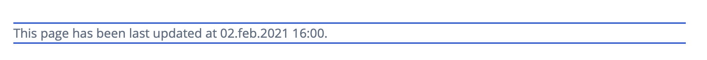
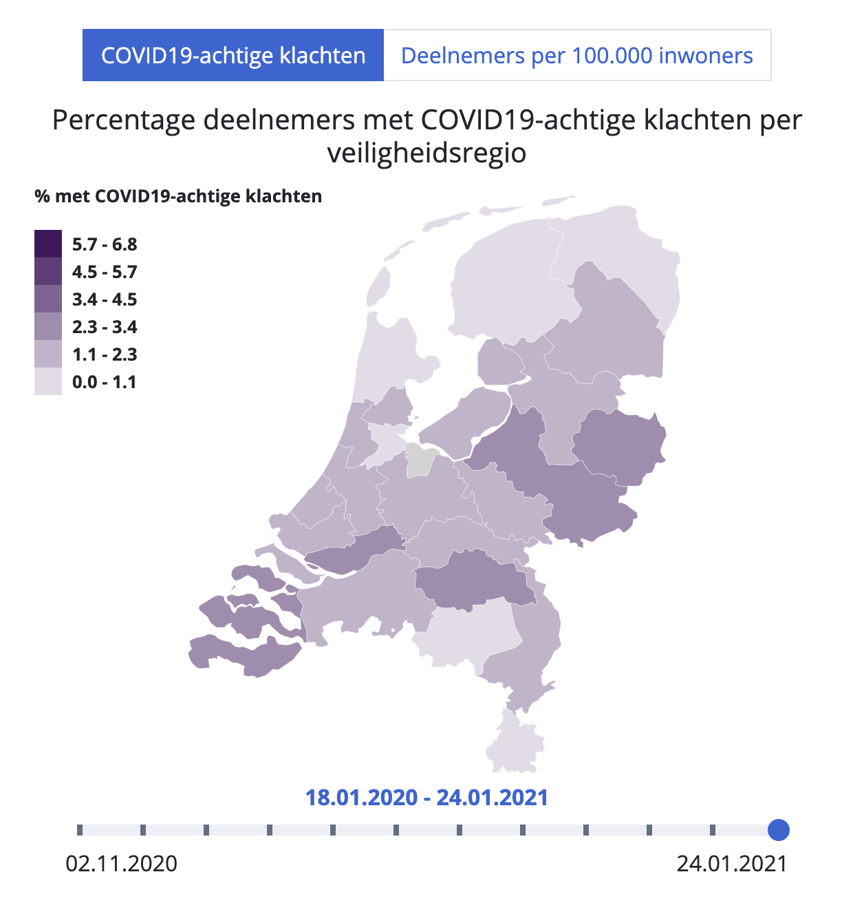
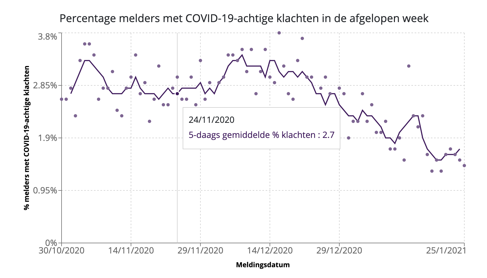

# Results Page

This document contains information about how to create page content for the results page.

## Markdown Flavors

Currently, the following renderers are available for selection:

- **default:** rendering standard markdowns, with one custom renderer for inline code.
- **chartRenderer:** extending the default renderer for custom syntax for Map Charts and Composed Line and Scatter chart.

### Custom Inline Code Renderer

Inline code syntax
```
`This page has been last updated at 02.feb.2021 16:00.`
```

This will be rendered as:



## Map Chart

This component can be used to display spatially distributed data that changes over time. With the tabs, you can select different data sources.
For example:




### Data Format
- geo data
- time series

### Add as page item
- how to add this component as page item

### Add from markdown
To reference (include) such a map chart from a markdown, you can use the following definition syntax:

```
[mapchart:/results/ggd-map-nl.json]:  /results/20210126_0801_kaart_data.json
```

The markdown page item needs to use the flavor type `chartRenderer`.

The json file for the geo data is referenced through the first filename (inside the brackets behind 'mapchart:').

The json file containing the style definitions and time series data, is defined in the url part of the definition behind the brackets (as seen in the above example).

Relative URLs are interpreted using the "content root url" as a base. Optionally, this would also accept absolute URLs starting with "https://" as well.


## Composed Line and Scatter Chart

This component can be used to display a time series as a line or scatter plot, or as a combination, like in this example:



### Data Format
- time series with points and line

### Add as page item
- how to add this component as page item

### Add from markdown
To reference (include) such a composed chart from a markdown, you can use the following definition syntax:

```
[line-and-scatter-chart]: /results/20210126_0801_percentage_klachten_over_tijd.json
```

The markdown page item needs to use the flavor type `chartRenderer`.

The URL can be relative to the "content root url" or absolute pathes starting with "https//:"
